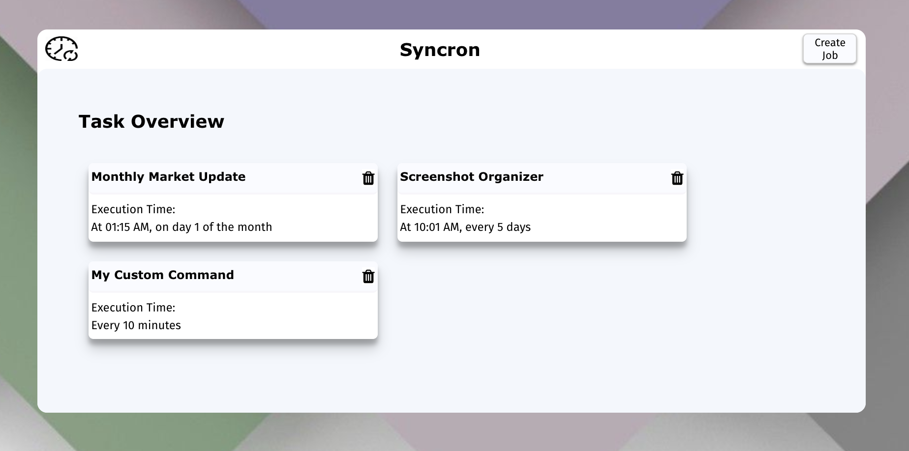

# Syncron

Syncron is a Desktop Application that enables users to create and manage automated tasks, e.g. sending emails with attachments at specific times. The tasks will be saved directly on the local PC of the user and will run even if the application is not closed.

  

## Motivation

### Motivation - general

The motivation for this project was a task that I had to perform manually at work (at [Scalable Capital](https://de.scalable.capital/)). Scalable Capital offers digital wealth management platforms (Robo Advisor) as a white label solution to its partners, e.g. to European banks. I was working in the project management team for one these partners. 

They wanted to run an incentive campaign and our task was to give them regular updates on how much money they have to pay as premiums to new and existing clients. I wrote a script in python that retrieves data from our SQL database and calculates the correct incentive premiums. On each Monday I had to run this script and then send an email to our external partners.

Syncron automatises tasks like this. You can schedule a task that runs a script at a specific time and sends the output of that script via email to recipients that you define.

### Motivation - technical perspective

There are some packages, e.g. in npm, that allow programmers to schedule tasks. But these tasks can only run on a server. This is not useful for individuals who don't have a server running all the time.

I wanted to create an application that not only programmers but also individuals can use. The solution was to store the tasks directly on the users PC. Thus, no running server is necessary. In order to write to and access tasks locally, I built a Desktop Application and not a Web Application.

## Tech Stack

#### Frameworks
* [Node JS](https://nodejs.org/en/)
* [React.js](https://reactjs.org/)
* [Electron](https://www.electronjs.org/)

#### Languages
* [Javascript](https://www.javascript.com/)
* [SASS](https://sass-lang.com/)
* [BASH](https://www.gnu.org/software/bash/)

Link to presentation video: https://www.youtube.com/watch?v=jvoropt880M
